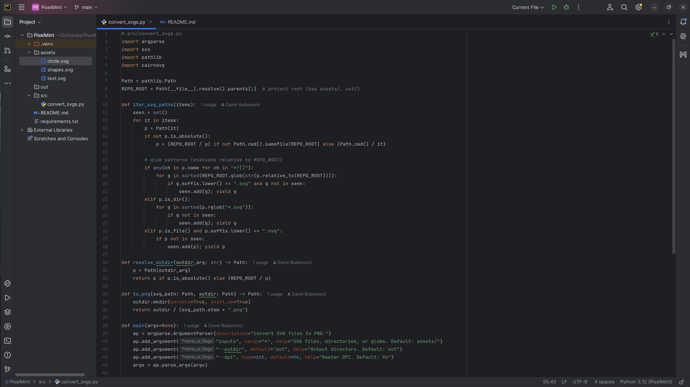

<p align="center">
  
</p>

## PixelMint

Batch convert SVG files to PNG with one Python command. Defaults to `assets/` → `out/`. Works from terminal and PyCharm on Linux Mint.

#### PixelMint provides:
+ Batch conversion for files & folders
+ Deterministic, sorted processing with de-duplication
+ CWD-independent paths for IDE runs
+ Simple flags for output folder and DPI

PixelMint YouTube Page — **[Visit Channel](https://www.youtube.com/@damirbubanovic6608)**

## Prerequisites
+ Python 3.8+
+ pip
+ Git (optional)
+ Linux Mint (tested)  
  Packages: `libcairo2`, `libpango-1.0-0`, `libgdk-pixbuf2.0-0`, `fonts-dejavu-core`

## Usage

```bash
# Create & Activate virtual environment
python3 -m venv .venv
source .venv/bin/activate

# install dependencies
pip install -r requirements.txt

# Default: convert all SVGs in assets/ to out/
python -m src.convert_svgs

# Convert a specific folder
python -m src.convert_svgs assets/icons

# Convert a glob (quote the pattern)
python -m src.convert_svgs "assets/*.svg"

# Convert multiple sources (folders, files, globs)
python -m src.convert_svgs assets logos/*.svg other_dir/file.svg

# Choose a different output directory
python -m src.convert_svgs assets --outdir build_png

# Change raster DPI
python -m src.convert_svgs assets --dpi 144

# Show help
python -m src.convert_svgs -h
```

## Creator Self Promo Links

Damir Bubanović

- **[DamirBubanovic.com](https://damirbubanovic.com/)**
- **[Youtube.com](https://www.youtube.com/@damirbubanovic6608)**
- **[GitHub](https://github.com/damir-bubanovic)**
- **[StackOwerflow](https://stackoverflow.com/users/11778242/damir-bubanovic)**
- **[Yahoo](damir.bubanovic@yahoo.com)**

## Acknowledgments

* Hat tip to anyone whose code was used including ChatGPT
* Inspiration
* etc